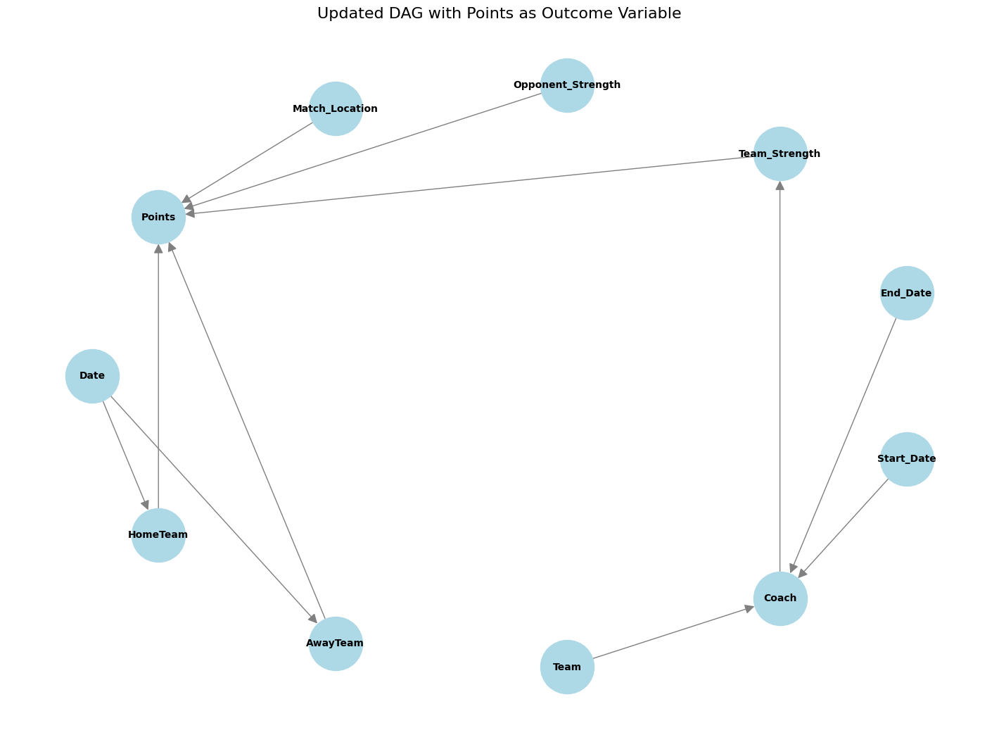

# Premier League Causal Analysis

## Description

This project aims to analyze the causal impact of coaching changes on
team performances during the 2023-2024 Premier League Season. Using a
dataset of match outcomes and coaching history, the analysis will
leverage regression techniques to infer causality.

## The Story

This project investigates the impact of mid-season head coaching changes
on team performance in the 2023–2024 Premier League season. Coaching
changes are often made in response to underperformance, but it’s unclear
whether they lead to measurable improvements in outcomes like win
percentage or league ranking.

The goal of this project is to analyze whether coaching changes improve
team performance and to evaluate the extent of their impact. This
analysis can provide insights into whether these changes justify their
cost and strategic importance.

## Ideal Dataset

The analysis uses the following data: 1. **Match Outcomes**: Includes
match dates, results, scores, and home/away teams. 2. **Coaching
Changes**: A table of head coaching changes with start and end dates for
each team. 3. **Additional Variables**: - **Team Strength**: Metrics
like squad value or past performance. - **Opponent Strength**: League
ranking or historical performance of opposing teams. - **Match
Context**: Home vs. away games and timing relative to the coaching
change.

## Factors Affecting Outcomes

Performance is influenced by several factors: 1. **Strategic
Leadership**: New coaches may bring different tactics or motivational
strategies. 2. **Team Dynamics**: Changes may disrupt or improve the
team’s cohesion. 3. **Timing**: Early-season changes allow time for
recovery, while late-season changes are often last-resort measures. 4.
**Player Quality**: The adaptability and skill of the players affect
results. 5. **Opponent Strength**: Performance depends on the difficulty
of the opposing teams.

## Addressing Feedback

### What do you mean by coaching changes?

Coaching changes refer to replacements of head coaches during the
season. This analysis focuses only on head coaching changes for clarity
and feasibility.

### How often do coaching changes occur during a season?

In the 2023–2024 Premier League season, there were approximately 7–10
mid-season head coaching changes.

### What’s the business angle?

The business angle focuses on understanding whether coaching changes
lead to better performance outcomes. These outcomes affect financial
metrics like sponsorships, ticket sales, and avoiding relegation, which
has major monetary implications.

### Have you found relevant data?

Yes, the analysis uses a Kaggle dataset for 2023–2024 Premier League
matches, supplemented with coaching change data manually compiled from
public records.

### What would the outcome be?

Key outcomes include: - **Win Percentage**: Improvement in match win
rates after a coaching change. - **Goal Differential**: Changes in
scoring and defensive performance. - **League Ranking**: Shifts in table
position after coaching changes.

### Other Variables to Include?

The analysis includes variables like: - Team and opponent strength. -
Match location (home vs. away). - Timing of coaching changes (early
vs. late season).

## Theory

Coaching changes are typically a response to poor results. This project
examines whether these changes improve team performance or if outcomes
are primarily driven by other factors, such as team quality or opponent
difficulty. By controlling for these variables, the analysis aims to
estimate the true impact of coaching changes.

# Identification Strategy

## 1. Where We Started

The objective of this project is to analyze the causal impact of
coaching changes on team performance in the Premier League, using Points
as the outcome variable. Points are calculated as 3 for a win, 1 for a
draw, and 0 for a loss. Our initial focus was on identifying key
variables and their relationships, as represented in the DAG, to develop
a strategy for isolating the causal effect of coaching changes.

## 2. Where We Are Going

The goal of this milestone is to specify an identification strategy that
ensures: - Key confounding variables are included to satisfy the
backdoor criterion. - Irrelevant variables are excluded to streamline
the model. - Decisions are based on sound causal assumptions supported
by the DAG.

## 3. Variables to Include Based on the DAG

To satisfy the backdoor criterion, we include the following variables:

1.  **Team_Strength**:
    - Captures the quality of the team, which influences both the
      likelihood of a coaching change and performance outcomes.
2.  **Opponent_Strength**:
    - Reflects the difficulty of the opposing team, which impacts match
      outcomes and adjusts for match context.
3.  **Match_Location**:
    - Accounts for the home or away setting, which influences team
      performance.
4.  **Date**:
    - Controls for temporal trends and seasonality, such as early-season
      vs. late-season effects.

## 4. Variables to Exclude Based on the DAG

The following variables are excluded to avoid unnecessary complexity and
overfitting:

1.  **Start_Date** and **End_Date**:
    - These are part of the treatment definition (coaching change) and
      should not be conditioned on directly.
2.  **HomeTeam** and **AwayTeam**:
    - Team identity is indirectly captured by Team_Strength.
3.  **Points**:
    - As the outcome variable, it should not be conditioned on.

## 5. Assumptions

1.  **Causal Relationship**:
    - Coaching changes impact team performance through Team_Strength and
      match context variables.
2.  **No Unmeasured Confounders**:
    - All relevant confounders (e.g., Team_Strength, Opponent_Strength)
      are included.
3.  **Linear or Nonlinear Effects**:
    - Relationships between variables may be linear, but interactions
      (e.g., between Team_Strength and Opponent_Strength) will be
      explored if necessary.

## 6. Satisfying the Backdoor Criterion

### Step 1: Identify Confounding Paths

Confounding paths from Coach Change to Points include: - Coach Change →
Team_Strength → Points

### Step 2: Block Confounding Paths

We block these paths by including: - **Team_Strength**: Accounts for
team quality. - **Opponent_Strength**: Adjusts for opposing team
difficulty. - **Match_Location**: Controls for home/away performance
differences.

### Step 3: Exclude Non-Critical Variables

Variables like Start_Date, End_Date, and Team Identity are excluded as
they are not necessary to block confounding paths.

## Project Organization

- `/code` Scripts with prefixes (e.g., `01_import-data.py`,
  `02_clean-data.py`) and functions in `/code/src`.
- `/data` Simulated and real data, the latter not pushed.
- `/figures` PNG images and plots.
- `/output` Output from model runs, not pushed.
- `/presentations` Presentation slides.
- `/private` A catch-all folder for miscellaneous files, not pushed.
- `/writing` Reports, posts, and case studies.
- `/.venv` Hidden project library, not pushed.
- `.gitignore` Hidden Git instructions file.
- `.python-version` Hidden Python version for the reproducible
  environment.
- `requirements.txt` Information on the reproducible environment.

## Reproducible Environment

After cloning this repository, go to the project’s terminal in Positron
and run `python -m venv .venv` to create the `/.venv` project library,
followed by `pip install -r requirements.txt` to install the specified
library versions.

Whenever you install new libraries or decide to update the versions of
libraries you use, run `pip freeze > requirements.txt` to update
`requirements.txt`.

For more details on using GitHub, Quarto, etc. see [ASC
Training](https://github.com/marcdotson/asc-training).
