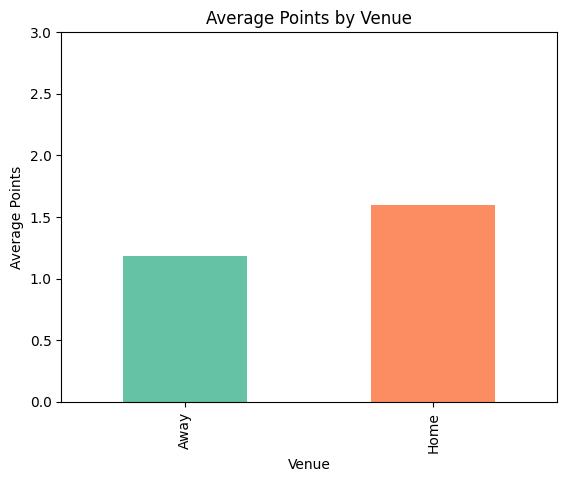
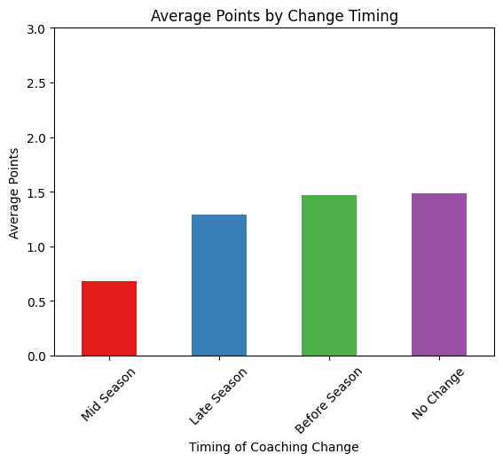

# Premier League Causal Analysis Report

## Description

This project aims to analyze the causal impact of coaching changes on
team performances during the 2023-2024 Premier League Season. Using a
dataset of match outcomes and coaching history, the analysis leverages
regression techniques to infer causality.

## The Story

This project investigates the impact of mid-season head coaching changes
on team performance in the 2023–2024 Premier League season. Coaching
changes are often made in response to underperformance, but it’s unclear
whether they lead to measurable improvements in outcomes like win
percentage or league ranking.

The goal of this project is to analyze whether coaching changes improve
team performance and evaluate the extent of their impact. The findings
will provide insights into whether these changes justify their cost and
strategic importance.

## Ideal Dataset

The analysis uses the following data:

1.  **Match Outcomes**: Match dates, results, scores, and home/away
    teams.
2.  **Coaching Changes**: A table of head coaching changes with start
    and end dates.
3.  **Additional Variables**:
    - **Team Strength**: Metrics like squad value or past performance.
    - **Opponent Strength**: League ranking or historical performance of
      opposing teams.
    - **Match Context**: Home vs. away games and timing relative to the
      coaching change.

## Factors Affecting Outcomes

Performance is influenced by several factors:

- **Strategic Leadership**: New coaches may bring different tactics or
  motivational strategies.
- **Team Dynamics**: Changes may disrupt or improve the team’s cohesion.
- **Timing**: Early-season changes allow time for recovery, while
  late-season changes are often last-resort measures.
- **Player Quality**: The adaptability and skill of the players affects
  results.
- **Opponent Strength**: Performance depends on the difficulty of the
  opposing teams.

## Addressing Feedback

- **What do you mean by coaching changes?**  
  Coaching changes refer to replacements of head coaches during the
  season. This analysis focuses only on head coaching changes for
  clarity and feasibility.

- **How often do coaching changes occur during a season?**  
  In the 2023–2024 Premier League season, there were approximately 7–10
  mid-season head coaching changes.

- **What’s the business angle?**  
  Coaching changes impact financial metrics like sponsorships, ticket
  sales, and avoiding relegation, which has major monetary implications.

- **Have you found relevant data?**  
  Yes, the analysis uses a Kaggle dataset for 2023–2024 Premier League
  matches, supplemented with coaching change data manually compiled from
  public records.

- **What would the outcome be?**  
  Key outcomes include:

  - **Win Percentage**: Improvement in match win rates after a coaching
    change.
  - **Goal Differential**: Changes in scoring and defensive performance.
  - **League Ranking**: Shifts in table position after coaching changes.

- **Other Variables to Include?**

  - Team and opponent strength.
  - Match location (home vs. away).
  - Timing of coaching changes (early vs. late season).

## Theory

Coaching changes are typically a response to poor results. This project
examines whether these changes improve team performance or if outcomes
are primarily driven by other factors, such as team quality or opponent
difficulty. By controlling for these variables, the analysis aims to
estimate the true impact of coaching changes.

## DAG

## Identification Strategy

### Where We Started

The objective of this project is to analyze the causal impact of
coaching changes on team performance in the Premier League, using
**Points** as the outcome variable. Points are calculated as **3 for a
win, 1 for a draw, and 0 for a loss**. Our initial focus was on
identifying key variables and their relationships, as represented in the
DAG, to develop a strategy for isolating the causal effect of coaching
changes.

### Where We Are Going

The goal of this milestone is to specify an identification strategy that
ensures:

- Key confounding variables are included to satisfy the **backdoor
  criterion**
- Irrelevant variables are excluded to streamline the model
- Decisions are based on sound **causal assumptions** supported by the
  DAG

### Variables to Include Based on the DAG

- **Date**: Controls for temporal trends and seasonality, such as
  early-season vs. late-season effects, which may influence both
  coaching changes and performance
- **Venue**: Captures whether the match was played at home or away,
  which is a key contextual factor that affects both coaching decisions
  and outcomes

### Variables to Exclude Based on the DAG

- **Team Strength**: A mediator through which coaching changes influence
  performance. Conditioning on it would block part of the causal pathway
- **Opponent Strength**: Also influenced by team dynamics and may serve
  as a mediator; excluding it preserves the total effect
- **Start_Date and End_Date**: These are part of the treatment
  definition (used to determine when coaching changes occur) and should
  not be conditioned on directly
- **HomeTeam and AwayTeam**: Team identity is indirectly captured by
  **Team Strength**
- **Points**: As the outcome variable, it should not be conditioned on

## Simulation

    ## Simulation

    import numpy as np
    import polars as pl
    from sklearn.linear_model import LinearRegression

    np.random.seed(42)

    # True parameters
    beta0 = 3       # Intercept
    beta1 = 2       # Effect of CoachChange
    beta2 = 1.5     # Effect of Date (e.g., time in season)
    beta3 = 1       # Effect of Venue (1 = Home, 0 = Away)
    n = 1000
    noise_sd = 2

    # Simulate confounders and treatment
    sim_data = pl.DataFrame({
        "Date": np.random.uniform(1, 38, size=n),  # Simulating matchweek (1 to 38)
        "Venue": np.random.choice([0, 1], size=n),  # 0 = Away, 1 = Home
    })

    # Simulate CoachChange with some dependency on Date
    sim_data = sim_data.with_columns(
        (pl.col("Date") > 19).cast(int).alias("CoachChange")  # More likely in mid/late season
    )

    # Simulate Points based on CoachChange + confounders
    sim_data = sim_data.with_columns([
        (
            beta0
            + beta1 * pl.col("CoachChange")
            + beta2 * pl.col("Date")
            + beta3 * pl.col("Venue")
            + np.random.normal(0, noise_sd, size=n)
        ).alias("Points")
    ])

    # Prepare for regression
    X = sim_data.select(["CoachChange", "Date", "Venue"]).to_numpy()
    y = sim_data["Points"].to_numpy()

    # Fit linear model
    model = LinearRegression(fit_intercept=True)
    model.fit(X, y)

    # Print estimated vs. true
    print(f"Estimated Intercept: {model.intercept_:.2f}")
    print(f"Estimated Coefficients: {model.coef_}")
    print(f"True Coefficients: [CoachChange: {beta1}, Date: {beta2}, Venue: {beta3}]")

## EDA

    # EDA
    import pandas as pd
    import matplotlib.pyplot as plt
    import seaborn as sns

    file_path = "/Users/alesandro/Downloads/matches_corrected.csv"
    df = pd.read_csv(file_path)

    ### BASIC DATA CHECKS ###
    Display basic info
    print("Dataset Info:")
    df.info()

    Display first few rows
    print("\nFirst 5 Rows:")
    print(df.head())

    Check for missing values
    print("\nMissing Values:")
    print(df.isnull().sum())

    Summary statistics
    print("\nSummary Statistics:")
    print(df.describe())

    ### DISTRIBUTION PLOTS ###

    # Points Distribution
    plt.figure(figsize=(8, 5))
    sns.histplot(df["Points"], bins=[-0.5, 0.5, 1.5, 3.5], discrete=True)
    plt.title("Distribution of Points")
    plt.xlabel("Points (0 = Loss, 1 = Draw, 3 = Win)")
    plt.ylabel("Frequency")
    plt.show()

    # Team Strength Distribution
    plt.figure(figsize=(8, 5))
    sns.histplot(df["Team_Strength"], bins=20, kde=True)
    plt.title("Distribution of Team Strength")
    plt.xlabel("Squad Value (£M)")
    plt.ylabel("Frequency")
    plt.show()

    # Opponent Strength Distribution
    plt.figure(figsize=(8, 5))
    sns.histplot(df["Opponent_Strength"], bins=20, kde=True)
    plt.title("Distribution of Opponent Strength")
    plt.xlabel("Squad Value (£M)")
    plt.ylabel("Frequency")
    plt.show()

    venue_means = df.groupby("Venue")["Points"].mean()
    venue_means.plot(kind="bar", color=["#66c2a5", "#fc8d62"])
    plt.title("Average Points by Venue")
    plt.ylabel("Average Points")
    plt.xticks([0, 1], ["Away", "Home"])
    plt.ylim(0, 3)
    plt.show()

    ### CORRELATION ANALYSIS ###
    plt.figure(figsize=(10, 6))
    sns.heatmap(
        df[["Points", "Team_Strength", "Opponent_Strength", "CoachChange"]].corr(),
        annot=True,
        cmap="coolwarm",
        fmt=".2f"
    )
    plt.title("Correlation Heatmap")
    plt.show()

    ### CATEGORICAL ANALYSIS ###

    # Countplot for Coaching Changes
    plt.figure(figsize=(8, 5))
    sns.countplot(x="CoachChange", data=df, palette="Set2")
    plt.title("Number of Matches With and Without a Coaching Change")
    plt.xlabel("Coach Change (0 = No Change, 1 = Change Before Match)")
    plt.ylabel("Number of Matches")
    plt.show()

    timing_means = df.groupby("Change_Timing")["Points"].mean().sort_values()
    timing_means.plot(kind="bar", color=sns.color_palette("Set1"))
    plt.title("Average Points by Change Timing")
    plt.ylabel("Average Points")
    plt.xlabel("Timing of Coaching Change")
    plt.xticks(rotation=45)
    plt.ylim(0, 3)
    plt.show()

- The **points distribution** confirms the expected trimodal pattern (0,
  1, and 3 points), aligning with the Premier League point system where
  a win earns 3 points, a draw earns 1, and a loss earns 0. The data
  shows an even spread of wins and losses, with fewer draws.

- **Team strength and opponent strength distributions** reveal a
  right-skewed pattern. A few teams have extremely high squad values,
  while most are clustered in a mid-range. This supports using market
  value as a proxy for team quality, but also hints at inequality in
  team resources.

- The **average points by venue** chart confirms home-field advantage:
  teams playing at home earn more points on average (around 1.6)
  compared to when they play away (around 1.2). This justifies including
  venue as a confounding variable in the causal model.

- The **correlation heatmap** shows a modest positive relationship
  between team strength and points (~0.20), and a negative one between
  opponent strength and points (~-0.28). Coaching changes show a weaker
  negative correlation with points (~-0.10), suggesting limited direct
  influence.

- The **distribution of coaching changes** shows that most matches were
  played without a recent coaching change (~500 games), while fewer
  (~260) had a coaching change beforehand. This reflects how coaching
  changes are relatively infrequent but not rare in the dataset.

- The **average points by change timing** bar chart suggests that
  **mid-season coaching changes are associated with the lowest average
  points**, supporting the idea that they may be reactive (in response
  to poor form) rather than transformative. Teams that changed coaches
  before or late in the season performed similarly to teams that didn’t
  change coaches.

- **Overall**, the data supports the idea that team strength and
  opponent difficulty are stronger performance drivers than coaching
  changes. Coaching switches appear more reactive than strategic.

## Estimate Causal Effect

    import numpy as np
    import pandas as pd
    import pymc as pm
    import arviz as az
    from sklearn.preprocessing import StandardScaler

    # Load dataset
    df = pd.read_csv("/Users/alesandro/Downloads/matches_corrected.csv")

    # Convert 'Venue' to numeric (1 = Home, 0 = Away)
    df["Venue"] = df["Venue"].map({"Home": 1, "Away": 0})

    # Convert 'Date' to numeric
    df["Date_numeric"] = pd.to_datetime(df["Date"], format="%m/%d/%Y").astype(int) / 10**9

    # One-hot encode Team (drop first to avoid multicollinearity)
    team_dummies = pd.get_dummies(df["Team"], prefix="Team", drop_first=True)

    # Combine all predictors: CoachChange, Date, Venue, Team dummies
    X_raw = pd.concat([
        df[["CoachChange", "Date_numeric", "Venue"]],
        team_dummies
    ], axis=1)

    # Standardize Date and Venue only
    scaler = StandardScaler()
    X_raw[["Date_numeric", "Venue"]] = scaler.fit_transform(X_raw[["Date_numeric", "Venue"]])

    # Final arrays
    X = X_raw.astype(float).to_numpy()
    y = df["Points"].to_numpy()

    # Bayesian model
    with pm.Model() as coaching_model:
        X_data = pm.Data("X_data", X)
        y_data = pm.Data("y_data", y)

        # Priors
        alpha = pm.Normal("alpha", mu=0, sigma=10)
        beta = pm.Normal("beta", mu=0, sigma=5, shape=X.shape[1])
        sigma = pm.Exponential("sigma", lam=1)

        # Likelihood
        mu = alpha + pm.math.dot(X_data, beta)
        y_obs = pm.Normal("y_obs", mu=mu, sigma=sigma, observed=y_data)

        # Sampling
        idata = pm.sample(1000, tune=1000, return_inferencedata=True, target_accept=0.95, cores=1)

    # Posterior summary
    summary = az.summary(idata, round_to=2)
    print(summary)

    # Trace plots
    az.plot_trace(idata, combined=True)

## Intermediate Slide Presentation

See my intermediate presentation
\[slides\]https://github.com/Alesandro-Rodriguez/is5150-ar/blob/main/presentations/intermediate-presentation.html

## Conjoint Analysis

As a supplemental milestone, I conducted a conjoint analysis survey to
explore how people prioritize different soccer team management
strategies. The goal was to better understand how strategic
decisions—such as how a team is built, trained, and managed—shape
perceptions of team performance. This ties back to the larger theme of
evaluating interventions in soccer, with coaching changes being one
example.

The survey asked respondents to choose between hypothetical team
profiles. Each profile varied along five key attributes: squad selection
strategy, training approach, match strategy, use of technology, and
player conditioning.

### Attribute importance

Squad selection was the most influential attribute in respondents’
choices, accounting for over 40% of decision weight. Match strategy was
next, followed by tech usage and training approach. Player conditioning
was considered the least important.

### Squad selection

Data-driven scouting was the most preferred option by a wide margin.
Youth academy focus and superstar transfers were also viewed positively,
while fan-voted player signings were rated the least effective.

### Training approach

Respondents favored high-intensity workloads. Rest and recovery-focused
approaches received negative scores, suggesting performance was
prioritized over recovery. Traditional and AI-optimized training had
little effect either way.

### Match strategy

Possession-based play was the top tactical preference. High-press
strategies were somewhat favored, while counter-attacks and
defensive-focused play (park-the-bus) were seen as undesirable.

### Tech usage

Real-time opponent analysis had the highest score. Wearable performance
tracking also scored positively. On the other hand, AI-powered
substitutions were rated very negatively, suggesting skepticism toward
automation in in-game decisions.

### Player conditioning

The most preferred approaches were self-regulated by players and
year-round intensive training. Recovery-first and strict rotation
systems scored negatively, further indicating a leaning toward
performance over rest.

### Summary

This analysis provides an early look at how different types of team
management decisions are perceived. While coaching changes are the focal
point of the main project, this exercise highlights that how a team is
built and managed—particularly in terms of squad strategy and
tactics—carries significant weight in how people judge potential
performance. It also shows hesitation around relying too heavily on
automation and AI in match-day decisions.

## Difference-in-Differences Consideration

One method I considered for estimating the impact of coaching changes
was the difference-in-differences (DiD) strategy. This approach compares
changes in outcomes for a treatment group (teams with a coaching change)
and a control group (teams without a change) over time. The goal is to
isolate the effect of the intervention by observing how the two groups
evolve from a shared baseline to a shared post-treatment period.

In the context of the Premier League, however, DiD presents some
limitations. Matches occur on different days and coaching changes happen
at various points in the season. As a result, there is no uniform pre-
and post-period that applies to all teams. This violates one of DiD’s
core requirements: a clearly defined and consistent treatment time.
Additionally, the parallel trends assumption—expecting both groups to
follow similar trajectories in the absence of treatment—is unlikely to
hold given the competitive structure and variability in matchups across
the season.

### Summary

While DiD is commonly used in policy and economics studies, I don’t
think this aligns well with this project. The variation in timing and
complexity of scheduling in professional soccer introduces challenges
that make this approach less suitable.

### Matching Strategy Consideration

As part of this milestone, I evaluated whether a matching strategy could
be used to estimate the causal effect of mid-season coaching changes on
team performance. Matching methods are often used to approximate
randomized experiments by pairing treated and untreated units with
similar characteristics. However, applying this approach requires
conditioning on pre-treatment covariates that affect both the treatment
assignment and the outcome.

In my project, two key confounders—team strength and opponent
strength—are considered mediators in the causal diagram. Including them
in a matching procedure would block part of the pathway through which
coaching changes influence team performance, violating the goal of
estimating the total effect. At the same time, excluding these variables
would leave important backdoor paths unblocked, undermining the validity
of the matching procedure altogether.

While matching is technically feasible with the dataset, it is not
appropriate for the identification strategy I’ve chosen. Because the
strategy is designed to isolate the total effect without conditioning on
mediators, a regression-based or Bayesian model is better suited for
estimating the impact of coaching changes. Matching would either bias
the estimate or fail to address confounding properly in this context.

## Consider Regression Discontinuity and Marginal Effects

For this milestone, I looked into whether regression discontinuity or
marginal effects could work to estimate the impact of mid-season
coaching changes on team performance. RDD typically works best when
treatment is assigned based on a clear cutoff in a continuous variable,
like age or test scores. In my case, there isn’t a universal rule or
threshold that triggers a coaching change. These decisions are made by
each club based on a mix of factors that aren’t consistent across teams
or situations.

I thought about using something like league position or recent results
as a running variable, but coaching changes don’t always happen at the
same point for everyone. Some teams switch coaches after a few losses,
others wait much longer. Since there’s no shared cutoff that determines
when the treatment kicks in, the main assumption behind RDD doesn’t hold
here.

That said, marginal effects are still useful. The Bayesian model I ran
includes coaching changes as a predictor, so I can interpret the average
effect of a change on team performance, controlling for things like date
and venue. It’s not a local comparison like in RDD, but it still gives a
sense of how outcomes shift, on average, when a team replaces their
coach. So while RDD doesn’t really fit this context, marginal effects
still offer meaningful insight.
