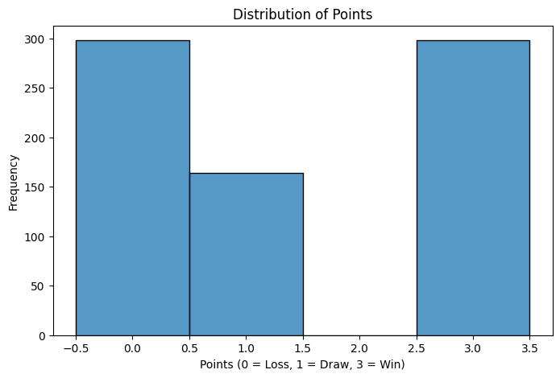

# Premier League Causal Analysis Report


## Description

This project aims to analyze the causal impact of coaching changes on
team performances during the 2023-2024 Premier League Season. Using a
dataset of match outcomes and coaching history, the analysis leverages
regression techniques to infer causality.

------------------------------------------------------------------------

## The Story

This project investigates the impact of mid-season head coaching changes
on team performance in the 2023–2024 Premier League season. Coaching
changes are often made in response to underperformance, but it’s unclear
whether they lead to measurable improvements in outcomes like win
percentage or league ranking.

The goal of this project is to analyze whether coaching changes improve
team performance and evaluate the extent of their impact. The findings
will provide insights into whether these changes justify their cost and
strategic importance.

------------------------------------------------------------------------

## Ideal Dataset

The analysis uses the following data:

1.  **Match Outcomes**: Match dates, results, scores, and home/away
    teams.
2.  **Coaching Changes**: A table of head coaching changes with start
    and end dates.
3.  **Additional Variables**:
    - **Team Strength**: Metrics like squad value or past performance.
    - **Opponent Strength**: League ranking or historical performance of
      opposing teams.
    - **Match Context**: Home vs. away games and timing relative to the
      coaching change.

------------------------------------------------------------------------

## Factors Affecting Outcomes

Performance is influenced by several factors:

- **Strategic Leadership**: New coaches may bring different tactics or
  motivational strategies.
- **Team Dynamics**: Changes may disrupt or improve the team’s cohesion.
- **Timing**: Early-season changes allow time for recovery, while
  late-season changes are often last-resort measures.
- **Player Quality**: The adaptability and skill of the players affects
  results.
- **Opponent Strength**: Performance depends on the difficulty of the
  opposing teams.

------------------------------------------------------------------------

## Addressing Feedback

- **What do you mean by coaching changes?**  
  Coaching changes refer to replacements of head coaches during the
  season. This analysis focuses only on head coaching changes for
  clarity and feasibility.

- **How often do coaching changes occur during a season?**  
  In the 2023–2024 Premier League season, there were approximately 7–10
  mid-season head coaching changes.

- **What’s the business angle?**  
  Coaching changes impact financial metrics like sponsorships, ticket
  sales, and avoiding relegation, which has major monetary implications.

- **Have you found relevant data?**  
  Yes, the analysis uses a Kaggle dataset for 2023–2024 Premier League
  matches, supplemented with coaching change data manually compiled from
  public records.

- **What would the outcome be?**  
  Key outcomes include:

  - **Win Percentage**: Improvement in match win rates after a coaching
    change.
  - **Goal Differential**: Changes in scoring and defensive performance.
  - **League Ranking**: Shifts in table position after coaching changes.

- **Other Variables to Include?**

  - Team and opponent strength.
  - Match location (home vs. away).
  - Timing of coaching changes (early vs. late season).

------------------------------------------------------------------------

## Theory

Coaching changes are typically a response to poor results. This project
examines whether these changes improve team performance or if outcomes
are primarily driven by other factors, such as team quality or opponent
difficulty. By controlling for these variables, the analysis aims to
estimate the true impact of coaching changes.

------------------------------------------------------------------------

## DAG


------------------------------------------------------------------------

## Identification Strategy

### Where We Started

The objective of this project is to analyze the causal impact of
coaching changes on team performance in the Premier League, using
**Points** as the outcome variable. Points are calculated as **3 for a
win, 1 for a draw, and 0 for a loss**. Our initial focus was on
identifying key variables and their relationships, as represented in the
DAG, to develop a strategy for isolating the causal effect of coaching
changes.

### Where We Are Going

The goal of this milestone is to specify an identification strategy that
ensures: - Key confounding variables are included to satisfy the
**backdoor criterion**. - Irrelevant variables are excluded to
streamline the model. - Decisions are based on sound **causal
assumptions** supported by the DAG.

### Variables to Include Based on the DAG

- **Team Strength**: Captures the quality of the team, which influences
  both the likelihood of a coaching change and performance outcomes.
- **Opponent Strength**: Reflects the difficulty of the opposing team,
  which impacts match outcomes and adjusts for match context.
- **Match Location**: Accounts for the home or away setting, which
  influences team performance.
- **Date**: Controls for temporal trends and seasonality, such as
  early-season vs. late-season effects.

### Variables to Exclude Based on the DAG

- **Start_Date and End_Date**: These are part of the treatment
  definition (coaching change) and should not be conditioned on
  directly.
- **HomeTeam and AwayTeam**: Team identity is indirectly captured by
  **Team Strength**.
- **Points**: As the outcome variable, it should not be conditioned on.

------------------------------------------------------------------------

``` python
## Simulation

import numpy as np
import polars as pl
import seaborn as sns
from sklearn.linear_model import LinearRegression

np.random.seed(42)

# True parameter values
beta0 = 3   # Intercept
beta1 = 2   # Effect of CoachChange
beta2 = 5   # Effect of Team_Strength
beta3 = -3  # Effect of Opponent_Strength
beta4 = 1   # Effect of Match_Location
n = 1000    # Sample size
noise_sd = 2  # Standard deviation of random noise

# Simulate predictors directly
sim_data = pl.DataFrame({
    "CoachChange": np.random.choice([0, 1], size=n), 
    "Team_Strength": np.random.uniform(50, 100, size=n),
    "Opponent_Strength": np.random.uniform(50, 100, size=n),
    "Match_Location": np.random.choice([0, 1], size=n)
})

# Simulate the outcome variable (Points) directly
sim_data = sim_data.with_columns([
    (
        beta0
        + beta1 * pl.col("CoachChange")
        + beta2 * pl.col("Team_Strength")
        + beta3 * pl.col("Opponent_Strength")
        + beta4 * pl.col("Match_Location")
        + np.random.normal(0, noise_sd, size=n)
    ).alias("Points")
])

# Prepare the data for regression
X = sim_data.select(["CoachChange", "Team_Strength", "Opponent_Strength", "Match_Location"]).to_numpy()
y = sim_data["Points"].to_numpy()

# Fit the linear model
model = LinearRegression(fit_intercept=True)
model.fit(X, y)

# Print the coefficients
print(f"Intercept: {model.intercept_}")
print(f"Coefficients: {model.coef_}")

# Compare to true parameter values
print(f"True Intercept: {beta0}")
print(f"True Coefficients: {beta1}, {beta2}, {beta3}, {beta4}")
```

------------------------------------------------------------------------

``` python
# EDA
import pandas as pd
import matplotlib.pyplot as plt
import seaborn as sns

file_path = "/Users/alesandro/Downloads/matches_corrected.csv"
df = pd.read_csv(file_path)

### BASIC DATA CHECKS ###
Display basic info
print("Dataset Info:")
df.info()

Display first few rows
print("\nFirst 5 Rows:")
print(df.head())

Check for missing values
print("\nMissing Values:")
print(df.isnull().sum())

Summary statistics
print("\nSummary Statistics:")
print(df.describe())
```

``` python
### DISTRIBUTION PLOTS ###
Points Distribution
plt.figure(figsize=(8, 5))
sns.histplot(df["Points"], bins=3, kde=True)
plt.title("Distribution of Points")
plt.xlabel("Points")
plt.ylabel("Frequency")
plt.show()

Team Strength Distribution
plt.figure(figsize=(8, 5))
sns.histplot(df["Team_Strength"], bins=20, kde=True)
plt.title("Distribution of Team Strength")
plt.xlabel("Squad Value (£M)")
plt.ylabel("Frequency")
plt.show()

Opponent Strength Distribution
plt.figure(figsize=(8, 5))
sns.histplot(df["Opponent_Strength"], bins=20, kde=True)
plt.title("Distribution of Opponent Strength")
plt.xlabel("Squad Value (M)")
plt.ylabel("Frequency")
plt.show()

### CORRELATION ANALYSIS ###
plt.figure(figsize=(10, 6))
sns.heatmap(df[["Points", "Team_Strength", "Opponent_Strength", "CoachChange"]].corr(), annot=True, cmap="coolwarm", fmt=".2f")
plt.title("Correlation Heatmap")
plt.show()

### CATEGORICAL ANALYSIS ###
Countplot for Coaching Changes
plt.figure(figsize=(8, 5))
sns.countplot(x="CoachChange", data=df, palette="Set2")
plt.title("Distribution of Coaching Changes")
plt.xlabel("Coach Change (0 = No, 1 = Yes)")
plt.ylabel("Frequency")
plt.show()

Points by Change Timing
plt.figure(figsize=(10, 5))
sns.boxplot(x="Change_Timing", y="Points", data=df, palette="Set1")
plt.title("Points Distribution by Change Timing")
plt.xlabel("Change Timing")
plt.ylabel("Points Earned")
plt.xticks(rotation=45)
plt.show()
```




- The **points distribution** confirms the expected trimodal pattern (0,
  1, and 3 points), which aligns with how points are awarded in the
  Premier League.

- **Team strength and opponent strength distributions** show a
  right-skewed pattern, meaning a few teams have significantly higher
  squad values. Most teams fall within a mid-range, which supports using
  squad value as a proxy for team quality.

- The **correlation heatmap** suggests that team strength has a moderate
  positive correlation (~0.20) with points, meaning stronger teams tend
  to perform better. Opponent strength has a negative correlation
  (~-0.28) with points, indicating tougher opponents make it harder to
  earn points. CoachChange has a weak negative correlation (~-0.10) with
  points, suggesting that a coaching change alone does not dramatically
  impact performance.

- The **distribution of coaching changes** shows that most matches
  occurred without a coaching change (~500), while ~300 had a coaching
  change beforehand. This highlights that coaching changes are
  relatively rare in the dataset.

- The **points distribution by change timing** suggests that teams
  making mid-season coaching changes tend to perform worse, with a lower
  median number of points. Before-season and late-season changes appear
  to have a more balanced performance distribution.

- Overall, the data indicates that team and opponent strength are
  stronger predictors of performance than coaching changes. Coaching
  changes may be a response to poor performance rather than a true
  intervention that improves outcomes.

------------------------------------------------------------------------

## Estimate Causal Effect

``` python
import numpy as np
import pandas as pd
import pymc as pm
import arviz as az

# Load dataset
df = pd.read_csv("/Users/alesandro/Downloads/matches_corrected.csv")

# Convert 'Venue' to numeric (1 for Home, 0 for Away)
df["Venue"] = df["Venue"].map({"Home": 1, "Away": 0})

# Prepare data (predictors and outcome)
X = df[["CoachChange", "Team_Strength", "Opponent_Strength", "Venue"]].to_numpy()
y = df["Points"].to_numpy()

# Bayesian model
with pm.Model() as coaching_model:
    # Data containers
    X_data = pm.Data("X_data", X)
    y_data = pm.Data("y_data", y)

    # Priors
    alpha = pm.Normal("alpha", mu=0, sigma=1)  # Intercept
    beta = pm.Normal("beta", mu=0, sigma=1, shape=4)  # One for each predictor
    sigma = pm.Exponential("sigma", lam=1)  # Standard deviation of error term

    # Likelihood
    mu = alpha + pm.math.dot(X_data, beta)
    y_obs = pm.Normal("y_obs", mu=mu, sigma=sigma, observed=y_data)

    # Sample from the posterior
    idata = pm.sample(1000, tune=1000, return_inferencedata=True)

# Summarize posterior estimates
summary = az.summary(idata, round_to=2)
print(summary)

# Visualize posterior distributions
az.plot_trace(idata, combined=True)
```

------------------------------------------------------------------------

## Intermediate Slide Presentation

See my intermediate presentation
\[slides\]https://github.com/Alesandro-Rodriguez/is5150-ar/blob/main/presentations/intermediate-presentation.html

------------------------------------------------------------------------

## Conjoint Analysis

As a supplemental milestone, I conducted a conjoint analysis survey to
explore how people prioritize different soccer team management
strategies. The goal was to better understand how strategic
decisions—such as how a team is built, trained, and managed—shape
perceptions of team performance. This ties back to the larger theme of
evaluating interventions in soccer, with coaching changes being one
example.

The survey asked respondents to choose between hypothetical team
profiles. Each profile varied along five key attributes: squad selection
strategy, training approach, match strategy, use of technology, and
player conditioning.

### Attribute importance

Squad selection was the most influential attribute in respondents’
choices, accounting for over 40% of decision weight. Match strategy was
next, followed by tech usage and training approach. Player conditioning
was considered the least important.


### Squad selection

Data-driven scouting was the most preferred option by a wide margin.
Youth academy focus and superstar transfers were also viewed positively,
while fan-voted player signings were rated the least effective.


### Training approach

Respondents favored high-intensity workloads. Rest and recovery-focused
approaches received negative scores, suggesting performance was
prioritized over recovery. Traditional and AI-optimized training had
little effect either way.


### Match strategy

Possession-based play was the top tactical preference. High-press
strategies were somewhat favored, while counter-attacks and
defensive-focused play (park-the-bus) were seen as undesirable.


### Tech usage

Real-time opponent analysis had the highest score. Wearable performance
tracking also scored positively. On the other hand, AI-powered
substitutions were rated very negatively, suggesting skepticism toward
automation in in-game decisions.


### Player conditioning

The most preferred approaches were self-regulated by players and
year-round intensive training. Recovery-first and strict rotation
systems scored negatively, further indicating a leaning toward
performance over rest.


### Summary

This analysis provides an early look at how different types of team
management decisions are perceived. While coaching changes are the focal
point of the main project, this exercise highlights that how a team is
built and managed—particularly in terms of squad strategy and
tactics—carries significant weight in how people judge potential
performance. It also shows hesitation around relying too heavily on
automation and AI in match-day decisions.

------------------------------------------------------------------------

## Difference-in-Differences Consideration

One method I considered for estimating the impact of coaching changes
was the difference-in-differences (DiD) strategy. This approach compares
changes in outcomes for a treatment group (teams with a coaching change)
and a control group (teams without a change) over time. The goal is to
isolate the effect of the intervention by observing how the two groups
evolve from a shared baseline to a shared post-treatment period.

In the context of the Premier League, however, DiD presents some
limitations. Matches occur on different days and coaching changes happen
at various points in the season. As a result, there is no uniform pre-
and post-period that applies to all teams. This violates one of DiD’s
core requirements: a clearly defined and consistent treatment time.
Additionally, the parallel trends assumption—expecting both groups to
follow similar trajectories in the absence of treatment—is unlikely to
hold given the competitive structure and variability in matchups across
the season.

### Summary

While DiD is commonly used in policy and economics studies, I don’t
think this aligns well with this project. The variation in timing and
complexity of scheduling in professional soccer introduces challenges
that make this approach less suitable.
